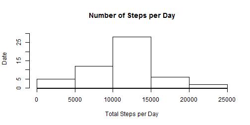
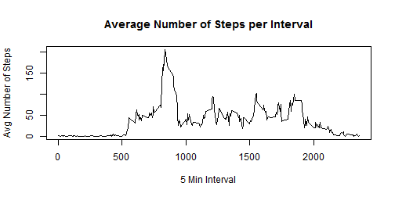
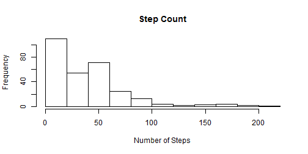
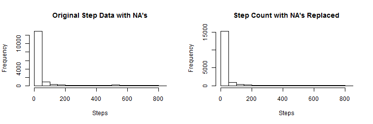

# Reproducible Research: Peer Assessment 1


## Loading and preprocessing the data

My first step is to set my local directory to my local GitHub repository clone.
Then I download and unzip the data to my local directory, I am sure to document
the date and timee that I accessed the data.

```r
local<-"C:/Users/Matthew/Documents/GitHub/RepData_PeerAssessment1"
setwd(local)

data.url<-"http://d396qusza40orc.cloudfront.net/repdata%2Fdata%2Factivity.zip"
xfile<-"C:/Users/Matthew/Documents/GitHub/RepData_PeerAssessment1/activity.zip"

download.file(data.url,destfile=xfile)
date.downloaded<-date()
unzip(xfile)

date.downloaded
```

```
## [1] "Sun Jun 08 20:51:13 2014"
```

```r
list.files(local)
```

```
##  [1] "activity.csv"      "activity.zip"      "cache"            
##  [4] "doc"               "figure"            "instructions_fig" 
##  [7] "PA1_template.html" "PA1_template.md"   "PA1_template.Rmd" 
## [10] "README.md"
```


Load the raw data into R

```r
myFile<-"C:/Users/Matthew/Documents/GitHub/RepData_PeerAssessment1/activity.csv"
pre.data<-read.csv(myFile,colClasses=c("numeric", "Date", "numeric"))
```

Next I want to get a look at the data and see what I'm dealing with

```r
head(pre.data)
```

```
##   steps       date interval
## 1    NA 2012-10-01        0
## 2    NA 2012-10-01        5
## 3    NA 2012-10-01       10
## 4    NA 2012-10-01       15
## 5    NA 2012-10-01       20
## 6    NA 2012-10-01       25
```

```r
summary(pre.data)
```

```
##      steps            date               interval   
##  Min.   :  0.0   Min.   :2012-10-01   Min.   :   0  
##  1st Qu.:  0.0   1st Qu.:2012-10-16   1st Qu.: 589  
##  Median :  0.0   Median :2012-10-31   Median :1178  
##  Mean   : 37.4   Mean   :2012-10-31   Mean   :1178  
##  3rd Qu.: 12.0   3rd Qu.:2012-11-15   3rd Qu.:1766  
##  Max.   :806.0   Max.   :2012-11-30   Max.   :2355  
##  NA's   :2304
```

I remove the records with NA in the steps column

```r
step.data<-pre.data[!is.na(pre.data$steps),]
head(step.data)
```

```
##     steps       date interval
## 289     0 2012-10-02        0
## 290     0 2012-10-02        5
## 291     0 2012-10-02       10
## 292     0 2012-10-02       15
## 293     0 2012-10-02       20
## 294     0 2012-10-02       25
```

```r
summary(step.data)
```

```
##      steps            date               interval   
##  Min.   :  0.0   Min.   :2012-10-02   Min.   :   0  
##  1st Qu.:  0.0   1st Qu.:2012-10-16   1st Qu.: 589  
##  Median :  0.0   Median :2012-10-29   Median :1178  
##  Mean   : 37.4   Mean   :2012-10-30   Mean   :1178  
##  3rd Qu.: 12.0   3rd Qu.:2012-11-16   3rd Qu.:1766  
##  Max.   :806.0   Max.   :2012-11-29   Max.   :2355
```

This leads to the next portion of the analysis...

## What is mean total number of steps taken per day?

Compute daily step amounts

```r
# split data by date
date.data<-split(step.data,step.data$date)
# find the sum of steps for each date
step<-as.data.frame(lapply(date.data,
                    function(date.data) colSums(date.data[,c("steps","interval")])))
```

A histogram of the number of steps taken per day.

```r
x<-step["steps",]
hist(as.numeric(x),main="Number of Steps per Day",xlab="Total Steps per Day",
     ylab="Date",plot=TRUE,ylim=c(1,31))
```

 

Now I will calculate the **mean** and **median** steps per day.

```r
mean(as.numeric(x))
```

```
## [1] 10766
```

```r
median(as.numeric(x))
```

```
## [1] 10765
```


## What is the average daily activity pattern?

This is a plot of the average number of steps taken during each 5 minute interval.

```r
ints<-unique(step.data$interval)
y<-tapply(step.data$steps,step.data$interval,mean)
head(y)
```

```
##       0       5      10      15      20      25 
## 1.71698 0.33962 0.13208 0.15094 0.07547 2.09434
```

```r
plot(ints,y,type="l",ylab="Avg Number of Steps",xlab="5 Min Interval",
     main="Average Number of Steps per Interval",xlim=c(0,2355))
```

 


The interval with the highest average steps taken is:

```r
z<-y[y==max(y)]
z
```

```
##   835 
## 206.2
```


## Imputing missing values

I'll use the **median** step count of all intervals to replace NA's in the data.
As you can see from the histogram below, the data is heavily skewed, the median
value reflects the data more accurately than the mean.


```r
hist(y,main="Step Count",ylab="Frequency",xlab="Number of Steps")
```

 

The **median** step count is:

```r
med.step<-median(y)
med.step
```

```
## [1] 34.11
```

Now replace NA values, and find the mean and median of the new dataset.

```r
par(mfrow=c(1,2))
day.data<-read.csv(myFile,colClasses=c("numeric", "Date", "numeric"))
hist(day.data$steps,main="Original Step Data with NA's",xlab="Steps")
day.data[is.na(day.data)]<-med.step
hist(day.data$steps,main="Step Count with NA's Replaced",xlab="Steps",ylab="Frequency")
```

 

```r
mean(day.data$steps)
```

```
## [1] 36.95
```

```r
median(day.data$steps)
```

```
## [1] 0
```

The impact of replacing the NA's with the average interval median:
    
    1. The frequency of the first interval incrased dramatically
    
    2. The median dropped to zero
    
    3. A cluster in the 500 step count area was "smoothed" during this process.
       

## Are there differences in activity patterns between weekdays and weekends?

```r
fdata<-factor(weekdays(day.data$date,abbreviate=T))
data.x<-cbind(day.data,fdata)
head(data.x)
```

```
##   steps       date interval fdata
## 1 34.11 2012-10-01        0   Mon
## 2 34.11 2012-10-01        5   Mon
## 3 34.11 2012-10-01       10   Mon
## 4 34.11 2012-10-01       15   Mon
## 5 34.11 2012-10-01       20   Mon
## 6 34.11 2012-10-01       25   Mon
```

```r
weekend<-c("Sat","Sun")
wd.data<-data.x[data.x$fdata!=weekend,]
we.data<-data.x[data.x$fdata==weekend,]
```

s
